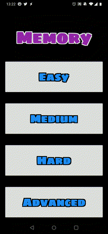

# Memory

*Memory* is a card game in which all of the cards are laid face down and two cards are flipped face up over each turn.
The object of the game is to turn over pairs of matching cards.

This game has been tested on both simulated and physical Android devices and simulated iOS devices.

## Background

This is a submission for the Flutter Create contest.  This example demonstrates the layout and animation capabilities of Flutter.

## Screenshots

